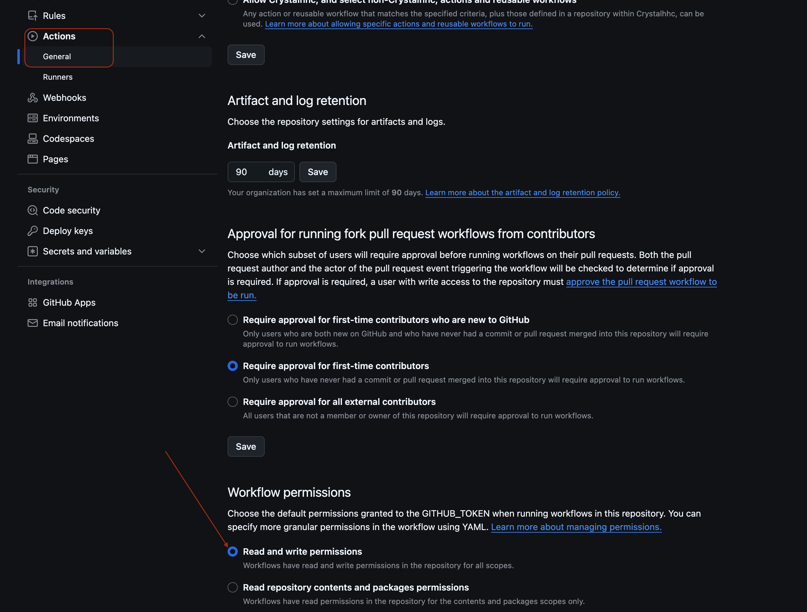

# Build a Multi-language Website with Mkdocs Material Theme

In this post, I'll share my experience of building a multi-language documentation website using [MkDocs](https://www.mkdocs.org/) with the [Material](https://squidfunk.github.io/mkdocs-material/) theme. This approach is perfect for maintaining separate but parallel documentation in multiple languages, ensuring a smooth experience for diverse audiences.

<!-- more -->

<div style="display: flex; justify-content: space-between; align-items: center;">
    <div style="flex: 1; margin-right: 10px;">
        
        <p style="text-align: center;"><em>English</em></p>
        <p style="font-size: 0.8em; color: #666;"></p>
    </div>
    <div style="flex: 1; margin-left: 10px;">
        
        <p style="text-align: center;"><em>正體（繁體）中文</em></p>
        <p style="font-size: 0.8em; color: #666;"></p>
    </div>
</div>


## Demo Site
You can see a live demo of this multi-language documentation setup at: [https://crystalhhc.github.io/myDocs/](https://crystalhhc.github.io/myDocs)


Feel free to explore the demo to get a better understanding of how the final product looks and functions.

## Why Separate Projects Instead of i18n Plugins?

You might wonder why we're creating separate projects for each language instead of using internationalization (i18n) plugins like [mkdocs-static-i18n](https://github.com/ultrabug/mkdocs-static-i18n) in a single project. Here are the key reasons:

1. **Simplicity and Flexibility**: Managing separate projects for each language allows for greater flexibility in content structure and customization. Each language version can evolve independently if needed.

2. **Performance**: With separate projects, each language version is built as a standalone site, which can lead to faster build times and better performance, especially for large documentation sets.

3. **Plugin Compatibility**: Some MkDocs plugins, particularly the blog plugin we're using, may not be fully compatible with i18n plugins. Using separate projects ensures full functionality of all desired features.

4. **Easier Content Management**: For teams with different people managing different language versions, separate projects can make it easier to assign responsibilities and manage workflows.

5. **Alignment with MkDocs Philosophy**: The creator of MkDocs Material, Martin Donath, [recommends this approach](https://github.com/squidfunk/mkdocs-material/blob/master/docs/setup/changing-the-language.md#site-language-selector) for multi-language setups, stating that "MkDocs is designed for building a single documentation in a single language."

While using i18n plugins can be suitable for some projects, especially those with simpler structures or where maintaining strict parity between language versions is crucial, our approach offers more flexibility and robustness for complex, evolving documentation needs.

## Project Layout
Our goal is to create a documentation site with both `English` and `Traditional Chinese` versions. Here's the basic project structure we'll be working with:
```
myDocs/
├── .venv/                 # Virtual environment directory
├── mydocs-en/             # English documentation project
│   ├── docs/
│   │   ├── index.md       # The documentation homepage (English)
│   │   └── ...            # Other markdown pages and files
│   └── mkdocs.yml         # Configuration file for English docs
├── mydocs-zh-TW/          # Traditional Chinese documentation project
│   ├── docs/
│   │   ├── index.md       # The documentation homepage (Traditional Chinese)
│   │   └── ...            # Other markdown pages and files
│   └── mkdocs.yml         # Configuration file for Traditional Chinese docs
└── README.md              # Project overview and instructions
```

## Quick Start: Clone the Sample Repository

If you want to get started quickly with a working example, you can clone my sample repository directly from GitHub. This repository contains a fully set up multi-language MkDocs project with both English and Traditional Chinese versions.

To clone the repository:

1. Open your terminal.
2. Navigate to the directory where you want to clone the project.
3. Run the following command:
```bash
git clone https://github.com/Crystalhhc/myDocs.git
```
4. Once cloned, navigate into the project directory:
```bash
cd myDocs
```
5. Set up a virtual environment and install the required dependencies:
```bash
python3 -m venv .venv
source .venv/bin/activate
pip install -r requirements.txt
```
Now you have a working multi-language MkDocs project! You can start exploring the structure, making changes, and seeing how everything works together.
To serve the documentation locally:
=== "English Version"
    ```bash
    cd mydocs-en
    mkdocs serve -a localhost:8000
    ```

=== "Traditional Chinese Version"
    ```bash
    cd mydocs-zh-TW
    mkdocs serve -a localhost:8001

    ```

!!! information

    `-a localhost:8000`: This is an option that specifies the address and  port on which the server should run  .


Visit the following URLs in your web browser to view the documentation:

- English: [http://localhost:8000](http://localhost:8000)
- Traditional Chinese: [http://localhost:8001](http://localhost:8001)

This sample repository provides a great starting point for your own multi-language documentation projects. You can now easily switch between languages in your local development environment. Feel free to modify and expand upon it to suit your needs.

In the following sections, we'll go through the process of setting up such a project from scratch, which will give you a deeper understanding of how everything works.

## Set Up from Scratch
1. Create the project root directory:
```bash
mkdir myDocs
cd myDocs
```
2. Set up a virtual environment:
```bash
python3 -m venv .venv
source .venv/bin/activate
```
3. Install MkDocs Material:
```bash
pip install mkdocs-material
```
## Creating Language-Specific Projects
=== "English"
    ```bash title="~/myDocs/"
    mkdocs new mydocs-en
    ```
=== "Traditional Chinese"
    ```bash title="~/myDocs/"
    mkdocs new mydocs-zh-TW
    ```

## Developing Multiple Language Versions
To work on both language versions simultaneously, you'll need to run two separate server instances. Here's how to do it:

1. Open two terminal windows or tabs.
2. In each terminal, navigate to the project root directory and activate the virtual environment.
3. Then, start a server for each language version as follows:

=== "Terminal 1 - English"
    ```bash title="~/myDocs/"
    cd mydocs-en
    sources .venv/bin/activate # to make sure you are currently in the virtual environment
    mkdocs serve -a localhost:8000
    ```
=== "Terminal 2 - Traditional Chinese"
    ```bash title="~/myDocs/"
    cd mydocs-zh-TW
    sources .venv/bin/activate
    mkdocs serve -a localhost:8001
    ```
This setup allows you to view and edit both language versions in real-time, ensuring consistency across your multi-language documentation. You can access:

- English:  `http://localhost:8000`
- Traditional Chinese: `http://localhost:8001` 

in your web browser.


## Configuring `mkdocs.yml` for Each Language
For each language version, you need to configure the `mkdocs.yml` file separately. Here's an example for both English and Traditional Chinese:

=== "English"

    ```yml title="./mydocs-en/mkdocs.yml" 
    site_name: My Docs - English
    site_url: https://crystalhhc.github.io/myDocs/ # set English as default language
    use_directory_urls: false
    theme:
      name: material
      language: en
    extra:
      alternate: # Language switcher
        - name: English
          link: https://crystalhhc.github.io/myDocs/ # English as    default
          lang: en
        - name: 正體中文
          link: https://crystalhhc.github.io/myDocs/zh-TW/
          lang: zh-TW
    ``` 

=== "Traditional Chinese"

    ```yml title="./mydocs-zh-TW/mkdocs.yml"    
    site_name: 我的文檔
    site_url: https://crystalhhc.github.io/myDocs/zh-TW/
    theme:
      name: material
      language: zh-TW
    extra:
      alternate: # Language switcher
        - name: English
          link: https://crystalhhc.github.io/myDocs/ # English as default language
          lang: en
        - name: 正體中文
          link: https://crystalhhc.github.io/myDocs/zh-TW/
          lang: zh-TW
    ```   
!!! Information
    Language Selection Settings:
    ```
    extra:
      alternates:
        - name: Language
          link:
          lang:
    ```     

    - `name`: Language name
    - `link`: Absolute url to the language site.
    - `lang`: an [ISO 639-1](https://squidfunk.github.io/mkdocs-material/setup/changing-the-language/) language code


## Nav Tab Setting
=== "English"

    ```yml title="./mydocs-en/mkdocs.yml"
    nav:
      - Home: index.md
      - Projects:
        - projects/index.md
        - OCR: ocr/index.md
      - OCR: 
        - Introductions: ocr/introduction.md
        - Roadmap: ocr/roadmap.md
        - Features: ocr/features.md
      - Blog: blog/index.md
      - Tags: tags.md
    ```
    
=== "Traditional Chinese"

    ```yml title="./mydocs-zh-TW/mkdocs.yml" 
    nav:
      - 首頁: 
          index.md
      - 計劃:
          - 計劃概覽: 
              projects/index.md
          - OCR: 
              ocr/index.md
      - OCR: 
          - 概括: 
              ocr/index.md
          - 介紹: 
              ocr/introduction.md
          - 路線圖: 
              ocr/roadmap.md
          - 特點: 
              ocr/features.md
      - 文章:  # can not affect
          blog/index.md 
      - 標籤: 
          tags.md 
    ```  

## The Final Project Layout
```
myDocs/
├── .venv/                 # Virtual environment directory
├── .github/
│   └── workflows/
│       └── deploy-docs.yml  # GitHub Actions workflow file
├── mydocs-en/             # English documentation project
│   ├── docs/
│   │   ├── index.md       # The documentation homepage (English)
│   │   ├── tags.md
│   │   ├── blog/
│   │   │   ├── index.md
│   │   │   └── posts/
│   │   │       └── first-post.md
│   │   ├── ocr/
│   │   │   ├── index.md
│   │   │   ├── introduction.md
│   │   │   ├── roadmap.md
│   │   │   └── features.md
│   │   └── projects/
│   │       └── index.md
│   └── mkdocs.yml         # Configuration file for English docs
├── mydocs-zh-TW/          # Traditional Chinese documentation project
│   ├── docs/
│   │   ├── index.md       # The documentation homepage (Traditional Chinese)
│   │   ├── tags.md
│   │   ├── blog/
│   │   │   ├── index.md
│   │   │   └── posts/
│   │   │       └── first-post.md
│   │   ├── ocr/
│   │   │   ├── index.md
│   │   │   ├── introduction.md
│   │   │   ├── roadmap.md
│   │   │   └── features.md
│   │   └── Projects/
│   │       └── index.md
│   └── mkdocs.yml         # Configuration file for Traditional Chinese docs
├── README.md              # Project overview and instructions
├── requirements.txt       # Python package requirements
└── .gitignore             # Git ignore file
```

## Syncing with GitHub
To sync your project with GitHub:

1. Initialize Git in the `root` directory:   
```bash
cd ~/myDocs
source .venv/bin/activate # make sure you are keeping in the virtual environment
git init
```
2. Create a .gitignore file:
```bash
touch .gitignore
```
3. Add and commit your files:
```bash
git add .
git commit -m "Initial commit"
```
4. Create a new repository on GitHub (let's call it `myDocs`)
5. Link your local repository to GitHub and push:
```bash
git branch -M main
git remote add origin https://github.com/YOUR_USERNAME/YOUR_REPO_NAME.git
git push -u origin main
```
## Deploying to GitHub Pages
To deploy your documentation to GitHub Pages:

1. Ensure your `mkdocs.yml` files are configured with the correct `site_url` as shown in the configuration examples above.
2. Create a `gh-pages` branch:
```bash
git checkout --orphan gh-pages
git rm -rf .
git commit --allow-empty -m "Initial gh-pages commit"
git push origin gh-pages
```
3. Switch back to the main branch:
```bash
git checkout main
```
4. Build and deploy your documentation:
```bash
cd ~/myDocs/mydocs-en
mkdocs gh-deploy --force

cd ~/myDocs/mydocs-zh-TW
mkdocs gh-deploy --force
```
5. In your GitHub repository settings, go to the "Pages" section and set the source to the `gh-pages` branch. This is an `important` step that is often overlooked.

    1. Go to your GitHub repository.
    2. Click on `Settings` in the top menu.
    3. In the left sidebar, click on `Pages`.
    4. Under `Source`, select `Deploy from a branch`.
    5. In the `Branch` dropdown, select `gh-pages`.
    6. Make sure the folder is set to `/ (root)`.
    7. Click `Save`.


!!! Note 

    Check Repository Permissions:

    - Go to your GitHub repository's settings, then to `Actions` under `Code and automation` in the left sidebar. 
    - Make sure `Read and write permissions` is selected under `Workflow permissions`.



## Defining GitHub Actions Workflow

To eliminate the need for manual intervention each time you update your documentation, let's design an automated deployment process by creating a `GitHub Actions` workflow:

1. Create a `.github/workflows` directory in your repository:
```bash
mkdir -p .github/workflows
```
2. Create a file named `deploy-docs.yml` in this directory:
```bash
touch .github/workflows/deploy-docs.yml
```
3. Add the following content to `deploy-docs.yml`:
```yml title="deploy-docs.yml"
name: Deploy MkDocs
on:
  push:
    branches:
      - main

jobs:
  deploy:
    runs-on: ubuntu-22.04  # Explicitly specify Ubuntu 22.04
    steps:
      - uses: actions/checkout@v3

      - name: Set up Python
        uses: actions/setup-python@v4
        with:
          python-version: '3.x'

      - name: Install dependencies
        run: |
          python -m pip install --upgrade pip
          pip install mkdocs-material

      - name: Build English docs
        run: |
          cd mydocs-en
          mkdocs build --site-dir ../site

      - name: Build Chinese docs
        run: |
          cd mydocs-zh-TW
          mkdocs build --site-dir ../site/zh-TW

      - name: Create .nojekyll file
        run: touch site/.nojekyll

      - name: Deploy
        uses: peaceiris/actions-gh-pages@v3
        with:
          github_token: ${{ secrets.GITHUB_TOKEN }}
          publish_dir: ./site
          force_orphan: true
```  
!!! Informaiton
Let's explain the details of the above configuration:

1. Title of this workflow
    - `name`: **Deploy MkDocs** - This is the name of the workflow.

1.  Note that this must be an absolute link. If it includes a domain part, it's
    used as defined. Otherwise the domain part of the [`site_url`][site_url] as
    set in `mkdocs.yml` is prepended to the link.

2. Event Trigger:
    - `on`: This section defines when the workflow should run.
    - `push`: The workflow will trigger on push events.
    - `branches: [main]`: It will only run when changes are pushed to the `main` branch.
3. Job Trigger:
    - `jobs`: This section defines the jobs that will run as part of this workflow.
    - `deploy`: This is the name of the job.
    - `runs-on: ubuntu-22.04`: This specifies that the job will run on an `Ubuntu 22.04` runner.
4. Steps Description:
   `steps`: This section lists the steps that will be executed in the job.
    
    - step 1 - `uses: actions/checkout@v3 `: To check out your repository so the workflow can access it.
    - step 2. - `name: Set up Python`: To sets up Python environment.

        - It uses the `actions/setup-python@v4` action to set up `Python 3.x`.

    - step 3 - `name: Install dependencies`: To install the necessary Python packages.

        - It upgrades `pip` and installs `mkdocs-material`.
    
    - step 4 - `name: Build English docs`: To build the `English` documentation.

        - It changes to the `mydocs-en` directory and runs mkdocs build.
        - `--site-dir ../site` option specifies where to output the built site.
    
    - step  5 - `name: Build Chinese docs`: To build the `Chinese` documentation.

        - It's similar to the English build, but outputs to `../site/zh-TW`.
    
    - step 6 - `name: Create .nojekyll file`: To create an empty `.nojekyll` file.

        - This file tells `GitHub Pages` not to process the site with `Jekyll`.
    
    - step 8 - `name: Deploy`: To deploy the built site to `GitHub Pages`.

        - It uses the `peaceiris/actions-gh-pages@v3` action for deployment.
        - `github_token: ${{ secrets.GITHUB_TOKEN }}`: This uses the built-in `GITHUB_TOKEN` for authentication.
        - `publish_dir: ./site`: This specifies the directory to publish.
        - `force_orphan: true`: This option ensures a clean deployment by removing the history of the `gh-pages` branch.

5. Commit and push this workflow file:
```bash
git add .
git commit -m "Add GitHub Actions workflow for MkDocs deployment"
git push -u origin main
```
This workflow will automatically build and deploy both language versions of your documentation whenever you push changes to the `main` branch.

After setting up the workflow, your documentation will be available at:

- English version: "https://YOUR_USERNAME.github.io/YOUR_REPO_NAME/en/"
- Chinese version: https://YOUR_USERNAME.github.io/YOUR_REPO_NAME/zh-TW/
- Root URL (https://YOUR_USERNAME.github.io/YOUR_REPO_NAME/) will redirect to the English version

## Further Studies

- In the future, large language models(LLM) could be incorporated to automate the translation work between different language versions.
