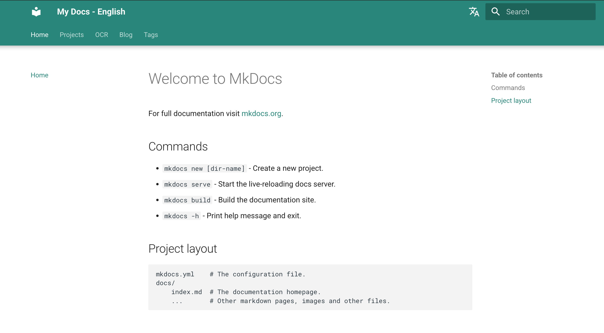
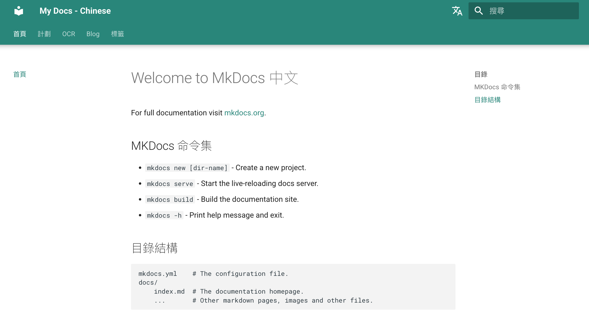
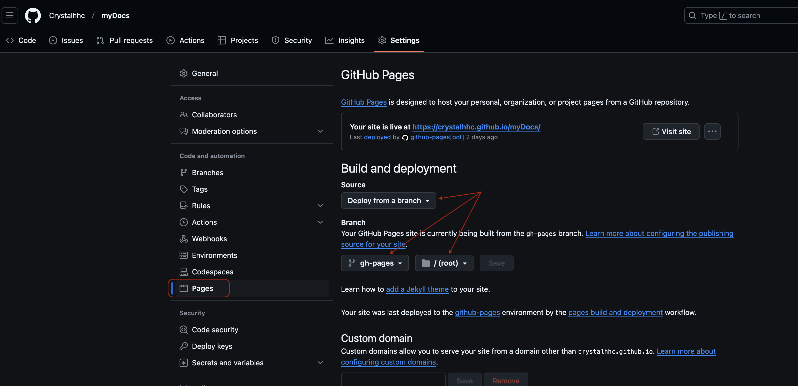

# 使用 Mkdocs Material 主題建立多語言網站

在這篇文章中，我將分享我使用 [MkDocs](https://www.mkdocs.org/) 和 [Material](https://squidfunk.github.io/mkdocs-material/) 主題建立多語言文檔網站的經驗。這種方法非常適合維護多種語言的獨立但平行的文檔，確保為不同語言的讀者提供流暢的體驗。

<!-- more -->

<div style="display: flex; justify-content: space-between; align-items: center;">
    <div style="flex: 1; margin-right: 10px;">
        
        <p style="text-align: center;"><em>English</em></p>
        <p style="font-size: 0.8em; color: #666;"></p>
    </div>
    <div style="flex: 1; margin-left: 10px;">
        
        <p style="text-align: center;"><em>正體（繁體）中文</em></p>
        <p style="font-size: 0.8em; color: #666;"></p>
    </div>
</div>

## DEMO網站
您可以在以下地址查看這個多語言文檔設置的實時演示：[https://crystalhhc.github.io/myDocs/](https://crystalhhc.github.io/myDocs)


## 為什麼選擇獨立專案而不是 `i18n` 插件？

您可能會想，為什麼我們要為每種語言創建獨立的專案，而不是在單一專案中使用國際化（i18n）插件，如 [mkdocs-static-i18n](https://github.com/ultrabug/mkdocs-static-i18n)。除了有與Material Theme 的 `Blog pliugin` [衝突問題](https://github.com/squidfunk/mkdocs-material/issues/4863)外，尚有下列的主要考量：

1. **簡單性和靈活性**：管理每種語言的獨立專案可以在內容結構和自定義方面提供更大的靈活性。如果需要，每個語言版本可以獨立發展。

2. **性能**：使用獨立專案，每個語言版本都被構建為獨立的網站，這可能會導致更快的構建時間和更好的性能，特別是對於大型文檔集。

3. **插件兼容性**：某些 MkDocs 插件，特別是我們使用的博客插件，可能與 i18n 插件不完全兼容。使用獨立專案可以確保所有所需功能的完全功能性。

4. **更容易的內容管理**：對於不同人員管理不同語言版本的團隊來說，獨立專案可以更容易地分配責任和管理工作流程。

5. **符合 MkDocs 理念**：MkDocs Material 的創建者 Martin Donath [推薦這種方法](https://github.com/squidfunk/mkdocs-material/blob/master/docs/setup/changing-the-language.md#site-language-selector)用於多語言設置，他表示"MkDocs 的設計目的是用單一語言構建單一文檔"。

雖然對於某些專案來說，使用 `i18n` 插件可能更合適，特別是那些結構較簡單或需要嚴格保持語言版本一致性的專案，但我們的方法為複雜、不斷發展的文檔需求提供了更多的靈活性和穩健性。

## 專案佈局
我們的目標是創建一個同時包含`英文`和`正體（繁體）中文`版本的文檔網站。以下是我們將使用的基本專案結構：

```
myDocs/
├── .venv/                 # 虛擬環境目錄
├── mydocs-en/             # 英文文檔專案
│   ├── docs/
│   │   ├── index.md       # 文檔首頁（英文）
│   │   └── ...            # 其他 markdown 頁面和文件
│   └── mkdocs.yml         # 英文文檔的配置文件
├── mydocs-zh-TW/          # 正體（繁體）中文文檔專案
│   ├── docs/
│   │   ├── index.md       # 文檔首頁（正體（繁體）中文）
│   │   └── ...            # 其他 markdown 頁面和文件
│   └── mkdocs.yml         # 正體（繁體）中文文檔的配置文件
└── README.md              # 專案概述和說明
```


## 快速開始：克隆（複製）範例儲存庫

如果您想快速開始並使用一個可工作的範例，您可以直接從 GitHub 克隆（複製）我的範例儲存庫。這個儲存庫包含一個完全設置好的多語言 MkDocs 專案，包括英文和正體（繁體）中文版本。

要克隆儲存庫：

1. 打開您的終端。
2. 導航到您想克隆專案的目錄。
3. 運行以下命令：
```bash
git clone https://github.com/Crystalhhc/myDocs.git
```
4. 克隆完成後，進入專案目錄(/myDocs)：
```bash
cd myDocs
```
5. 設置虛擬環境並安裝所需的依賴(Dependencies)：
```bash
python3 -m venv .venv
source .venv/bin/activate
pip install -r requirements.txt
```
現在您有了一個可工作的多語言 MkDocs 專案！您可以開始探索結構，進行更改，並了解所有組件如何協同工作。
要在本地運行文檔：

=== "英文版本"
    ```bash
    cd mydocs-en
    mkdocs serve -a localhost:8000 
    ```    
=== "正體（繁體）中文版本"
    ```bash
    cd mydocs-zh-TW
    mkdocs serve -a localhost:8001
    ```
!!! information
    `-a localhost:8000`：

      - `a` 是一個選項，指定服務器應該在哪個地址和端口上運行。

在您的網絡瀏覽器中訪問以下 URL 以查看文檔：

- 英文：http://localhost:8000
- 正體（繁體）中文：http://localhost:8001

這個範例儲存庫為您自己的多語言文檔專案提供了一個很好的起點。您現在可以在本地開發環境中輕鬆切換語言。請隨意修改和擴展它以滿足您的需求。

在接下來的部分中，我們將介紹從頭開始設置這樣一個專案的過程，這將讓您更深入地了解一切是如何運作的。

## 從頭開始設置
1. 創建專案根目錄：
```bash
mkdir myDocs
cd myDocs
```
2. 設置虛擬環境：
```bash
python3 -m venv .venv
source .venv/bin/activate
```
3. 安裝 MkDocs Material：
```bash
pip install mkdocs-material
```
## 創建特定語言的專案
=== "英文"
    bash title="~/myDocs/"     mkdocs new mydocs-en     
=== "正體（繁體）中文"
    bash title="~/myDocs/"     mkdocs new mydocs-zh-TW  

## 同時開發多語言版本
要同時處理兩種語言版本，您需要運行兩個獨立的服務器實例。以下是操作方法：

1. 打開兩個終端窗口或標籤。
2. 在每個終端中，導航到專案根目錄並激活虛擬環境。
3. 然後，按如下方式為每個語言版本啟動服務器：
=== "終端 1 - 英文"
    ```bash title="~/myDocs/"
    cd mydocs-en
    sources .venv/bin/activate # 確保您當前處於虛擬環境中
    mkdocs serve -a localhost:8000  
    ```   
=== "終端 2 - 正體（繁體）中文"
    ```bash title="~/myDocs"
    cd mydocs-zh-TW
    sources .venv/bin/activate
    mkdocs serve -a localhost:8001
    ```     

這種設置允許您實時查看和編輯兩種語言版本，確保多語言文檔的一致性。您可以在網絡瀏覽器中訪問：

- 英文：http://localhost:8000
- 正體（繁體）中文：http://localhost:8001

## 為每種語言配置 `mkdocs.yml`
對於每個語言版本，您需要單獨配置 mkdocs.yml 文件。以下是英文和正體（繁體）中文的範例：
=== "English"

    ```yml title="./mydocs-en/mkdocs.yml" 
    site_name: My Docs - English
    site_url: https://crystalhhc.github.io/myDocs/ # set English as default language
    use_directory_urls: false
    theme:
      name: material
      language: en
    extra:
      alternate: # Language switcher
        - name: English
          link: https://crystalhhc.github.io/myDocs/ # English as    default
          lang: en
        - name: 正體（繁體）中文
          link: https://crystalhhc.github.io/myDocs/zh-TW/
          lang: zh-TW
    ``` 

=== "Traditional Chinese"

    ```yml title="./mydocs-zh-TW/mkdocs.yml"    
    site_name: 我的文檔
    site_url: https://crystalhhc.github.io/myDocs/zh-TW/
    theme:
      name: material
      language: zh-TW
    extra:
      alternate: # Language switcher
        - name: English
          link: https://crystalhhc.github.io/myDocs/ # English as default language
          lang: en
        - name: 正體（繁體）中文
          link: https://crystalhhc.github.io/myDocs/zh-TW/
          lang: zh-TW
    ``` 
!!! Information
    語言切換設定說明:
    ```
    extra:
      alternates:
        - name: Language
          link:
          lang:
    ```     

    - `name`: Language name
    - `link`: Absolute url to the language site.
    - `lang`: an [ISO 639-1](https://squidfunk.github.io/mkdocs-material/setup/changing-the-language/) language code

## 導航標籤設置(Nav Tab Setting)
=== "English"

    ```yml title="./mydocs-en/mkdocs.yml"
    nav:
      - Home: index.md
      - Projects:
        - projects/index.md
        - OCR: ocr/index.md
      - OCR: 
        - Introductions: ocr/introduction.md
        - Roadmap: ocr/roadmap.md
        - Features: ocr/features.md
      - Blog: blog/index.md
      - Tags: tags.md
    ```
    
=== "Traditional Chinese"

    ```yml title="./mydocs-zh-TW/mkdocs.yml" 
    nav:
      - 首頁: 
          index.md
      - 計劃:
          - 計劃概覽: 
              projects/index.md
          - OCR: 
              ocr/index.md
      - OCR: 
          - 概括: 
              ocr/index.md
          - 介紹: 
              ocr/introduction.md
          - 路線圖: 
              ocr/roadmap.md
          - 特點: 
              ocr/features.md
      - 文章:  # can not affect
          blog/index.md 
      - 標籤: 
          tags.md 
    ```  

## 完整的目錄結構
```
myDocs/
├── .venv/                 # Virtual environment directory
├── .github/
│   └── workflows/
│       └── deploy-docs.yml  # GitHub Actions workflow file
├── mydocs-en/             # English documentation project
│   ├── docs/
│   │   ├── index.md       # The documentation homepage (English)
│   │   ├── tags.md
│   │   ├── blog/
│   │   │   ├── index.md
│   │   │   └── posts/
│   │   │       └── first-post.md
│   │   ├── ocr/
│   │   │   ├── index.md
│   │   │   ├── introduction.md
│   │   │   ├── roadmap.md
│   │   │   └── features.md
│   │   └── projects/
│   │       └── index.md
│   └── mkdocs.yml         # Configuration file for English docs
├── mydocs-zh-TW/          # Traditional Chinese documentation project
│   ├── docs/
│   │   ├── index.md       # The documentation homepage (Traditional Chinese)
│   │   ├── tags.md
│   │   ├── blog/
│   │   │   ├── index.md
│   │   │   └── posts/
│   │   │       └── first-post.md
│   │   ├── ocr/
│   │   │   ├── index.md
│   │   │   ├── introduction.md
│   │   │   ├── roadmap.md
│   │   │   └── features.md
│   │   └── Projects/
│   │       └── index.md
│   └── mkdocs.yml         # Configuration file for Traditional Chinese docs
├── README.md              # Project overview and instructions
├── requirements.txt       # Python package requirements
└── .gitignore             # Git ignore file
```

## 與GitHub同步
將專案與GitHub同步:

1. 在根目錄(如：`~/mydocs/`)中初始化 Git：  
```bash
cd ~/myDocs
source .venv/bin/activate # make sure you are keeping in the virtual environment
git init
```
2. 創建 `.gitignore` 文件，並填入過濾條件，避免無需要的文檔上傳到`github`：
```bash
touch .gitignore
```
3. 添加並提交您的文件
```bash
git add .
git commit -m "Initial commit"
```
4. 在 GitHub 上創建一個新的儲存庫（我們姑且稱它為 `myDocs`）
5. 將您的本地儲存庫連接到 GitHub 並推送：
```bash
git branch -M main
git remote add origin https://github.com/YOUR_USERNAME/YOUR_REPO_NAME.git
git push -u origin main
```
## 部署到 GitHub Pages
下列步驟要將您的文檔部署到 [GitHub Pages](https://pages.github.com/)：

1. 確保您的 `mkdocs.yml` 文件已按照上面的配置範例正確設置了 `site_url`。
2. 創建一個 `gh-pages` 分支：
```bash
git checkout --orphan gh-pages
git rm -rf .
git commit --allow-empty -m "Initial gh-pages commit"
git push origin gh-pages
```
3. 切回主分支`main`：
```bash
git checkout main
```
4. 構建並部署您的文檔：
```bash
cd ~/myDocs/mydocs-en
mkdocs gh-deploy --force

cd ~/myDocs/mydocs-zh-TW
mkdocs gh-deploy --force
```
5. 在您的 GitHub 儲存庫設定中，前往 "Pages" 部分，並將來源設置為 gh-pages 分支。這是一個經常被忽略的`重要`步驟。
    1. 前往您的 GitHub 儲存庫。
    2. 點擊頂部選單中的 `Settings`（設定）。
    3. 在左側側邊欄中，點擊 `Pages`（頁面）。
    4. 在 `Source`（來源）下，選擇 `Deploy from a branch`（從分支部署）。
    5. 在 `Branch`（分支）下拉選單中，選擇 `gh-pages`。
    6. 確保資料夾設置為 `/ (root)`（根目錄）。
    7. 點擊 `Save`（儲存）。



!!! Note 

    檢查儲存庫權限：

    - 進入您的 GitHub 儲存庫設置，然後在左側欄中的 `Code and automation` 下找到 `Actions`。
    - 確保在 `Workflow permissions` 下選擇了 `Read and write permissions`。


## 定義 GitHub Actions 工作流程

為了消除每次更新文檔時手動干預的需求，讓我們通過創建一個 `GitHub Actions` 工作流程來設計一個自動化部署流程：

1. 在您的儲存庫中創建一個 `.github/workflows` 目錄：
```bash
mkdir -p .github/workflows
```
2. 在此目錄中創建一個名為 `deploy-docs.yml` 的文件：
```bash
touch .github/workflows/deploy-docs.yml
```
3. 將以下內容添加到 `deploy-docs.yml`：
```yml title="deploy-docs.yml"
name: Deploy MkDocs
on:
  push:
    branches:
      - main

jobs:
  deploy:
    runs-on: ubuntu-22.04  # Explicitly specify Ubuntu 22.04
    steps:
      - uses: actions/checkout@v3

      - name: Set up Python
        uses: actions/setup-python@v4
        with:
          python-version: '3.x'

      - name: Install dependencies
        run: |
          python -m pip install --upgrade pip
          pip install mkdocs-material

      - name: Build English docs
        run: |
          cd mydocs-en
          mkdocs build --site-dir ../site

      - name: Build Chinese docs
        run: |
          cd mydocs-zh-TW
          mkdocs build --site-dir ../site/zh-TW

      - name: Create .nojekyll file
        run: touch site/.nojekyll

      - name: Deploy
        uses: peaceiris/actions-gh-pages@v3
        with:
          github_token: ${{ secrets.GITHUB_TOKEN }}
          publish_dir: ./site
          force_orphan: true
```  
!!! Informaiton

讓我們解釋上述配置的詳細信息：

1. 此工作流程的標題
    `name: Deploy MkDocs` - 這是工作流程的名稱。
2. 事件觸發器：

    - `on`：此部分定義了工作流程應該何時運行。
    - `push`：工作流程將在推送事件時觸發。
    - `branches: [main]`：它只會在更改被推送到 main 分支時運行。

3. 作業觸發器：

    - `jobs`：定義此工作流程所需的步驟。
    - `deploy`：此為部署作業定義
    - `runs-on: ubuntu-22.04`：指定作業將在 `Ubuntu 22.04` 運行器上運行。

4. 步驟描述：`steps`：此部分列出了將在作業中執行的步驟。

    步驟 1 - `uses: actions/checkout@v3`：此步驟檢出您的儲存庫，以便工作流程可以訪問它。

    步驟 2 - `name: Set up Python`: 設置 Python 環境

      - 它使用 actions/setup-python@v4 動作來設置 Python 3.x。

    步驟 3 - `name: Install dependencies`: 安裝依賴：
      
      - 此步驟安裝必要的 Python 包。
      - 它升級 pip 並安裝 mkdocs-material。

    步驟 4 -  `name: Build English docs`: 構建英文文檔：
      
      - 它切換到 `mydocs-en` 目錄並運行 `mkdocs build`。
      - `--site-dir ../site`: 選項指定輸出構建站點的位置。
    
    步驟 5 - `name: Build Chinese docs`: 構建中文文檔：
      
      - 它類似於英文構建，但輸出到 `../site/zh-TW`。

    步驟 6 - `name: Create .nojekyll file`: 創建 `.nojekyll` 文件：

      - 此文件告訴 GitHub Pages 不要使用 `Jekyll` 處理站點。

    步驟 8 - `name: Deploy`: 部署
      
      - 這最後一步將構建的站點部署到 `GitHub Pages`。
      - 它使用 `peaceiris/actions-gh-pages@v3` 動作進行部署。
      - `github_token: ${{ secrets.GITHUB_TOKEN }}`：這使用內置的 GITHUB_TOKEN 進行身份驗證。
      - `publish_dir: ./site`：這指定要發布的目錄。
      - `force_orphan: true`：此選項通過刪除 gh-pages 分支的歷史記錄確保乾淨的部署。

5. 提交並推送此工作流程文件：
```bash
git add .
git commit -m "Add GitHub Actions workflow for MkDocs deployment"
git push -u origin main
```
每當您將更改推送到 `main` 分支時，此工作流程將自動構建並部署您文檔的兩種語言版本。
設置工作流程後，您的文檔將在以下位置可用：

- 英文版本：「https://YOUR_USERNAME.github.io/YOUR_REPO_NAME/en/」
- 中文版本：https://YOUR_USERNAME.github.io/YOUR_REPO_NAME/zh-TW/
- 預設根 URL（https://YOUR_USERNAME.github.io/YOUR_REPO_NAME/）將重定向到英文版本

## 後續研究
- 未來可以加入大語言模型，設法讓各語系之間的翻譯工作更自動

